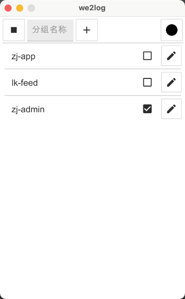
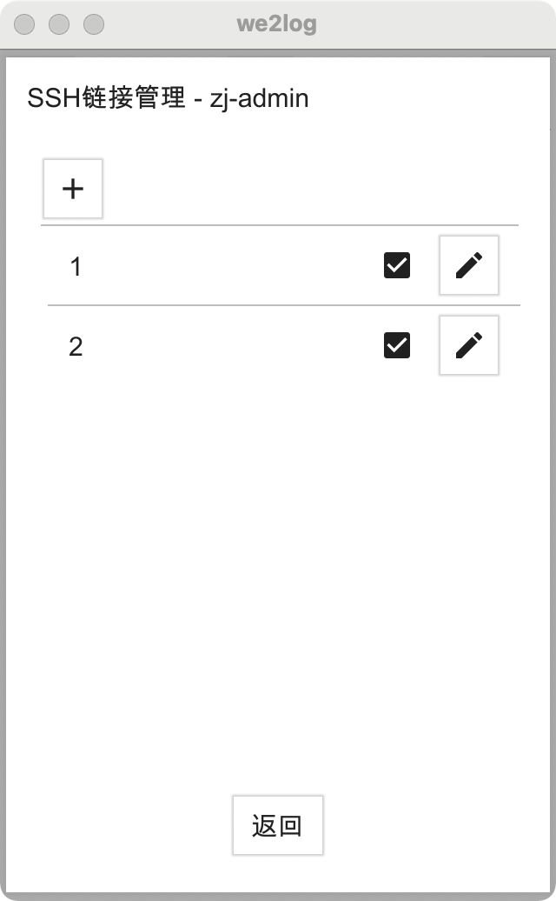
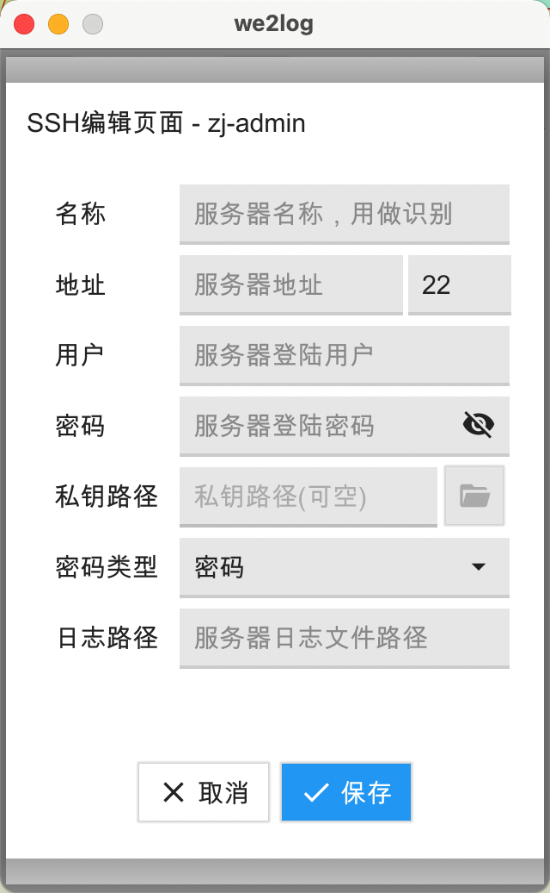
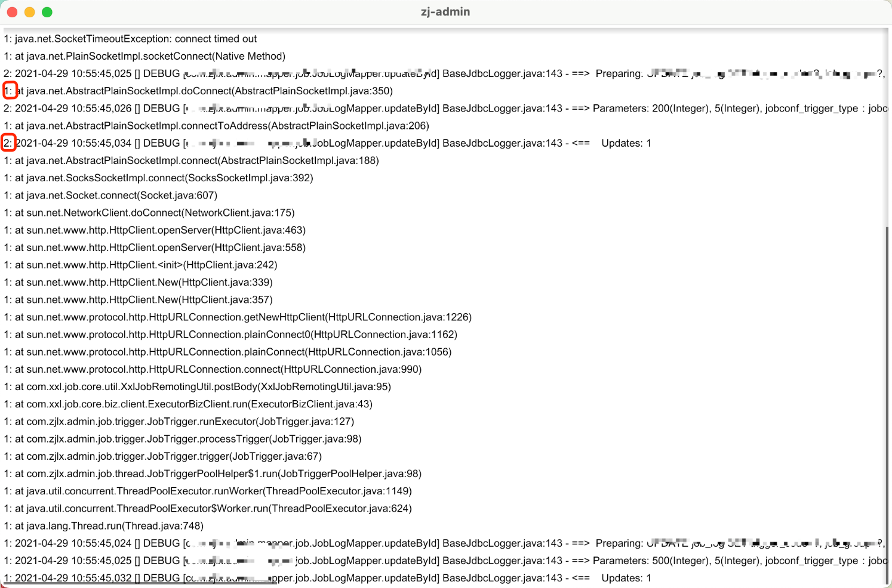

# we2log 简单本地日志监听

解决多台相同服务之间的日志临时查看不方便，多窗口打开麻烦，使用ssh链接并命令`tail -f`监听日志文件，并把**相同服务的日志输出进行融合**

## 演示界面

### 主设置界面

多个分组对应如同多个微服务

### 分组ssh链接界面

可添加和修改ssh链接

### ssh链接添加或修改界面

### 日志打印界面

红圈的1和2就是分组admin下，ssh连接中名称1和2服务器

## 日志窗口快捷键

- <kbd>F</kbd> 全屏切换
- <kbd>空格</kbd> 暂停接收日志

## 配置文件

配置文件是用yaml格式存放，文件存放在`{当前用户目录下}/.we2log/confing.yml`，部分配置可在此处修改或删除

### 配置参数解释

|  字段   | 作用  |
|  ---  | ---  |
| log.lines  | 一个分组窗口日志最多行数，越多占用内存越多(默认100) |
| log.font-path  | 字体路径(解决乱码或可自定义字体文件) |
| log.size  | 字体字号大小(默认11) |
| log.group.name  | 分组名称 |
| log.group.on-off  | 分组是否开启 |
| log.group.ssh.name  | ssh链接是否开启 |
| log.group.ssh.host  | ssh服务器ip地址 |
| log.group.ssh.port  | ssh服务器端口 |
| log.group.ssh.username  | ssh服务器用户 |
| log.group.ssh.password  | ssh服务器密码(选择私钥不填) |
| log.group.ssh.pri-key-path  | 链接ssh服务器私钥路径(选择密码可不填，默认当前用户目录下的/.ssh/id_rsa文件) |
| log.group.ssh.pw-type  | 密码类型 0密码 1私钥 |
| log.group.ssh.log-path  | 日志路径 |
| log.group.ssh.on-off  | ssh是否开启 |